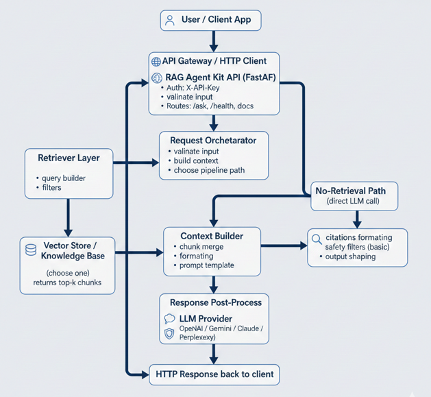
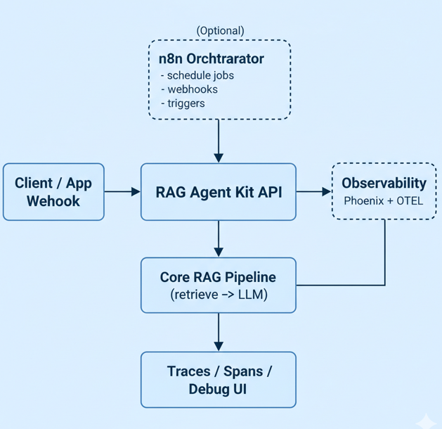

# System Architecture – RAG Agent Kit

This document describes the high-level architecture of the RAG Agent Kit,
including the core request flow, optional components, and major decision points.

---

## Core Request Flow

The following diagram represents the default request lifecycle for the RAG Agent Kit.
This flow applies to all environments and does not require optional components.



```
[User / Client App]
        |
        v
[API Gateway / HTTP Client]
        |
        v
[RAG Agent Kit API (FastAPI)]
  - Auth: X-API-Key
  - Routes: /ask, /health, /docs
        |
        v
[Request Orchestrator]
  - validate input
  - build context
  - choose pipeline path
        |
        +-----------------------------+
        |                             |
        v                             v
[Retriever Layer]                [No-Retrieval Path]
  - query builder                   (direct LLM call)
  - filters
        |
        v
[Vector Store / Knowledge Base]
  - (choose one)
  - returns top-k chunks
        |
        v
[Context Builder]
  - chunk merge
  - formatting
  - prompt template
        |
        v
[LLM Provider (choose one)]
  - OpenAI / Gemini / Claude / Perplexity
        |
        v
[Response Post-Process]
  - citations formatting
  - safety filters (basic)
  - output shaping
        |
        v
[HTTP Response back to client]
```

---

## Architecture Layers Overview

- **API Layer** – HTTP interface, authentication, routing
- **Orchestration Layer** – request validation and pipeline selection
- **Retrieval Layer** – optional knowledge retrieval from vector store
- **Context Layer** – prompt construction and context shaping
- **LLM Layer** – provider-agnostic model invocation
- **Post-Processing Layer** – output formatting and safety checks

---

## Decision Points (Pluggable Components)

### LLM Provider
Selectable per environment or request:
- OpenAI
- Gemini
- Claude
- Perplexity (optional, web-enabled)

### Vector Store
- PostgreSQL + pgvector (default)
- Other providers can be integrated in the future

### Retrieval Mode
- RAG (retrieve → generate)
- Direct LLM (no retrieval)

---

## Optional Components

The following components are NOT required for core functionality.
They are enabled only when explicitly configured.



```
                         (Optional)
                  +-------------------+
                  |  n8n Orchestrator |
                  |  - schedule jobs  |
                  |  - webhooks       |
                  |  - triggers       |
                  +---------+---------+
                            |
                            v
[Client / App / Webhook] -> [RAG Agent Kit API] ------------------------------+
                                |                                            |
                                |                                            |
                                v                                            v
                        [Core RAG Pipeline]                           (Optional)
                        (retrieve -> LLM)                        [Observability]
                                |                                Phoenix + OTEL
                                |                                   |
                                +-------------------+---------------+
                                                    |
                                                    v
                                        [Traces / Spans / Debug UI]
```

---

## Observability (Optional)

Observability is implemented using Phoenix and OpenTelemetry.
It is isolated under the `observability/` directory and disabled by default.

See:
- docs/07_observability/OVERVIEW.md
- observability/README.md

---

## Infrastructure Scope

- Local development runs using Docker Compose
- Terraform + AWS files describe infrastructure only
- No cloud resources are required to run or test the system locally
- Infrastructure code does not affect runtime logic

---

## Non-Goals

- Full production monitoring
- Vendor lock-in to a single LLM provider
- Mandatory cloud deployment
